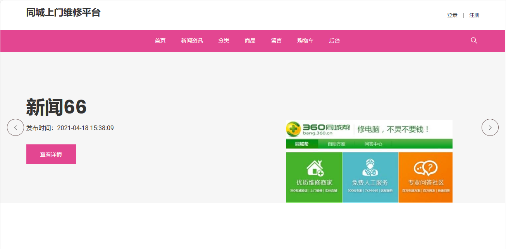
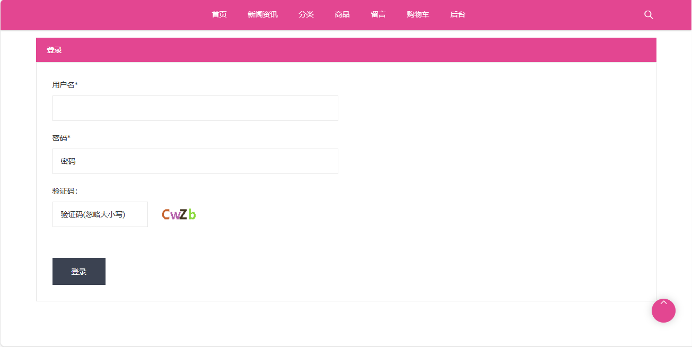
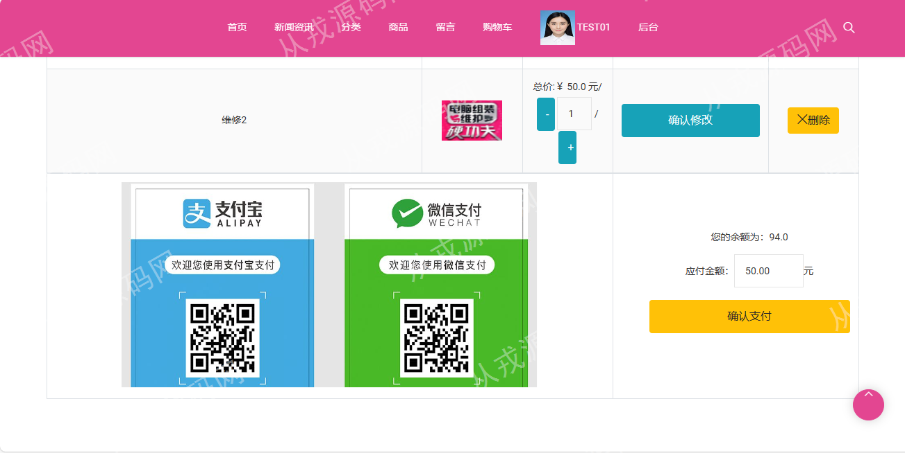
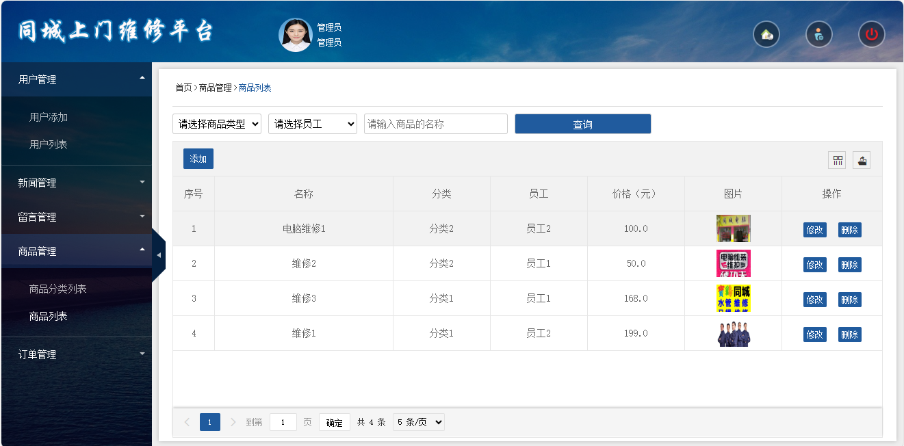
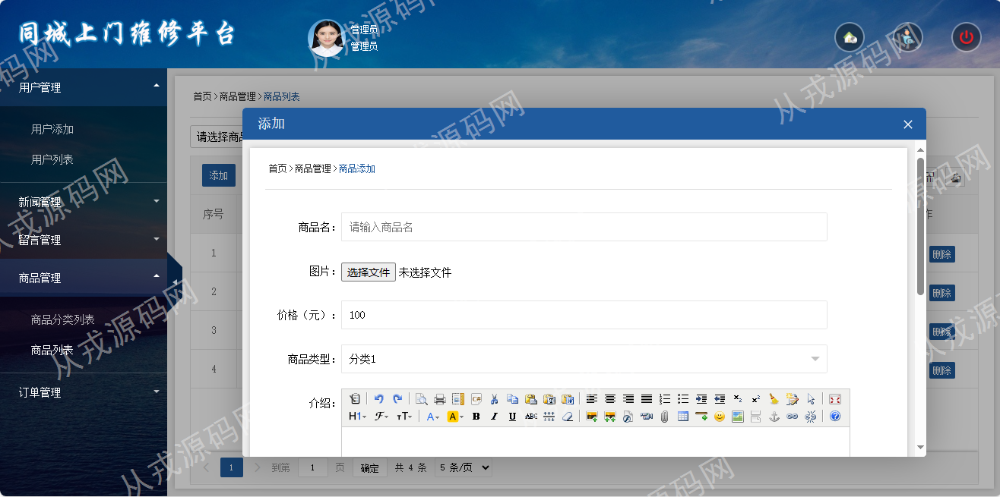

<h1 align="center">54.同城上门维修平台管理系统</h1>

- <b>完整代码获取地址：从戎源码网 ([https://armycodes.com/](https://armycodes.com/))</b>
- <b>技术探讨、资料分享，请加QQ群：692619798</b> 
- <b>作者微信：19941326836  QQ：952045282</b> 
- <b>承接计算机毕业设计、Java毕业设计、Python毕业设计、深度学习、机器学习</b>
- <b>选题+开题报告+任务书+程序定制+安装调试+论文+答辩ppt 一条龙服务</b>
- <b>所有选题地址 ([https://github.com/YuLin-Coder/AllProjectCatalog](https://github.com/YuLin-Coder/AllProjectCatalog)) </b>

## 项目介绍
基于ssm的同城上门维修平台管理系统：前端jsp、jquery、bootstrap，后端 spring、mybatis，集成订单管理、商品管理、商品类型管理、商品浏览、购物车等功能于一体的系统。

## 功能介绍

### 用户

- 基本功能：登录、注册、退出、个人信息修改、密码修改、头像更换上传
- 核心功能：商品列表、商品详情、分类导航、轮播图、维修服务商品添加购物车、购物车里修改订单信息、在线支付、订单列表、订单详情、订单退货操作
- 其它功能：浏览商品资料、资讯详情、留言列表、发布留言

### 管理员

- 商品分类管理：商品分类信息增删查改、关键词搜索
- 商品管理：商品信息增删查改、根据商品分类搜索、根据商品名称搜索、商品图片上传、商品详情支持富文本编辑
- 订单管理：订单列表、订单查看、订单删除、维修完成操作
- 留言管理：留言列表、留言回复、留言删除、根据留言名称搜索记录、回复内容支持富文本编辑
- 新闻管理：新闻信息的增删改查、图片上传修改、富文本编辑框
- 用户管理：用户信息的增删查改、关键词搜索、用户头像上传修改
- 个人设置：管理员可以维护自己的个人信息，包括密码修改等

### 员工

- 新闻查看：新闻列表、新闻详情查看、关键词搜索
- 商品管理：商品信息增删查改、根据商品分类搜索、根据商品名称搜索、商品图片上传、商品详情支持富文本编辑
- 订单管理：订单列表、订单查看、订单删除、维修完成操作

## 环境

- <b>IntelliJ IDEA 2021.3</b>

- <b>Mysql 5.7.26</b>

- <b>Tomcat 7.0.73</b>

- <b>JDK 1.8</b>

## 运行截图

