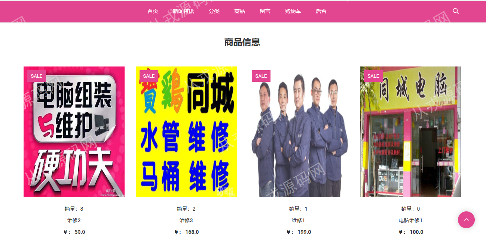
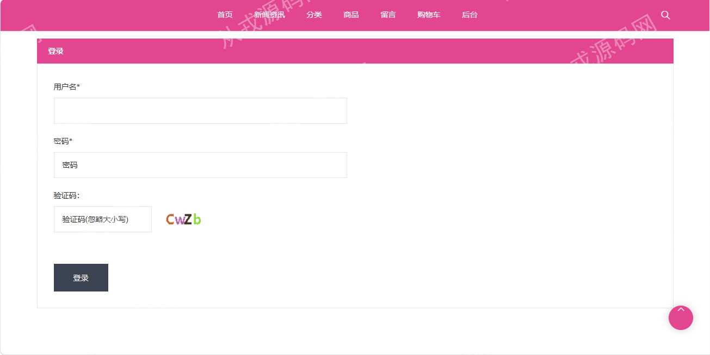

<h1 align="center">54.同城上门维修平台管理系统</h1>

 获取sql文件 QQ: 386869957 QQ群: 377586148 

 [推荐站点: 从戎源码网](https://armycodes.com/) 

## 简介

> 本代码来源于网络,仅供学习参考使用!
> 
> 管理后台登录地址：http://localhost:8080/tongchengweixiu/admin/login.do
> 
> 管理员：admin 123456
> 
> 员工：sj02 123456
> 
> 用户前台地址：http://localhost:8080/tongchengweixiu/
> 
> 用户：test01 123456
> 

## 项目介绍
基于ssm的同城上门维修平台管理系统：前端jsp、jquery、bootstrap，后端 spring、mybatis，集成订单管理、商品管理、商品类型管理、商品浏览、购物车等功能于一体的系统。

## 功能介绍

### 用户

- 基本功能：登录、注册、退出、个人信息修改、密码修改、头像更换上传
- 核心功能：商品列表、商品详情、分类导航、轮播图、维修服务商品添加购物车、购物车里修改订单信息、在线支付、订单列表、订单详情、订单退货操作
- 其它功能：浏览商品资料、资讯详情、留言列表、发布留言

### 管理员

- 商品分类管理：商品分类信息增删查改、关键词搜索
- 商品管理：商品信息增删查改、根据商品分类搜索、根据商品名称搜索、商品图片上传、商品详情支持富文本编辑
- 订单管理：订单列表、订单查看、订单删除、维修完成操作
- 留言管理：留言列表、留言回复、留言删除、根据留言名称搜索记录、回复内容支持富文本编辑
- 新闻管理：新闻信息的增删改查、图片上传修改、富文本编辑框
- 用户管理：用户信息的增删查改、关键词搜索、用户头像上传修改
- 个人设置：管理员可以维护自己的个人信息，包括密码修改等

### 员工

- 新闻查看：新闻列表、新闻详情查看、关键词搜索
- 商品管理：商品信息增删查改、根据商品分类搜索、根据商品名称搜索、商品图片上传、商品详情支持富文本编辑
- 订单管理：订单列表、订单查看、订单删除、维修完成操作

## 环境

- <b>IntelliJ IDEA 2009.3</b>

- <b>Mysql 5.7.26</b>

- <b>Tomcat 7.0.73</b>

- <b>JDK 1.8</b>

## 运行截图

